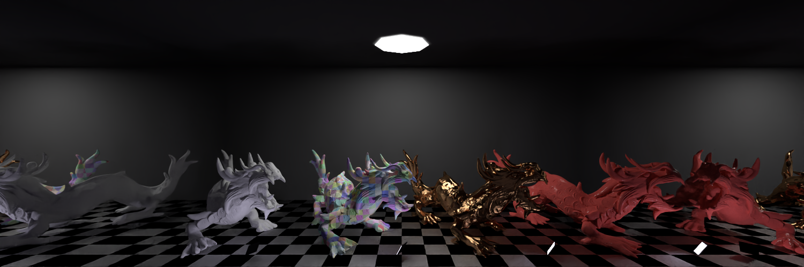
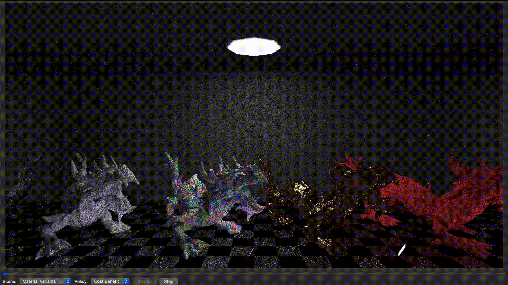
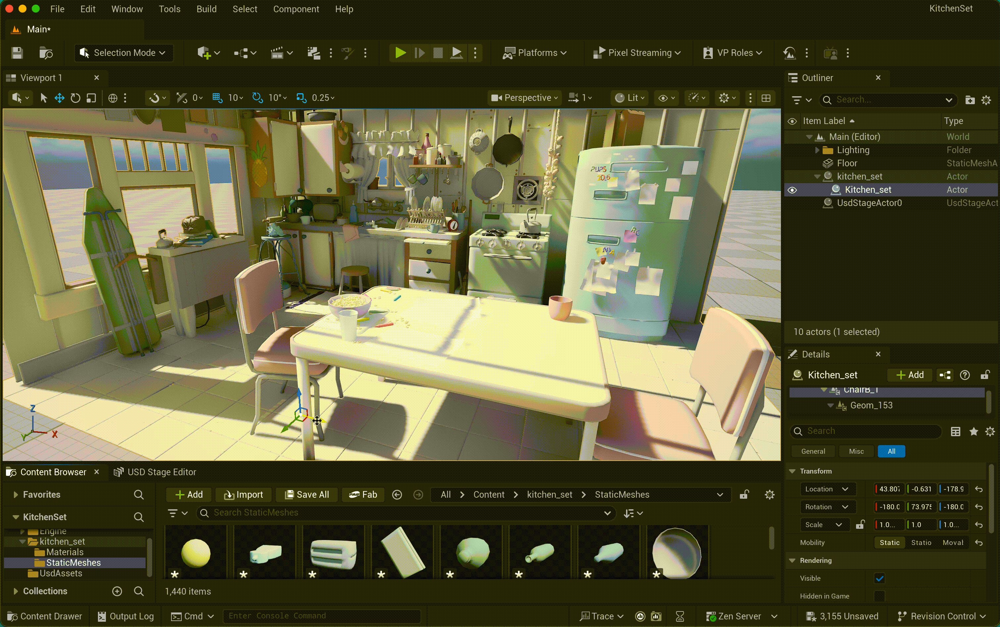
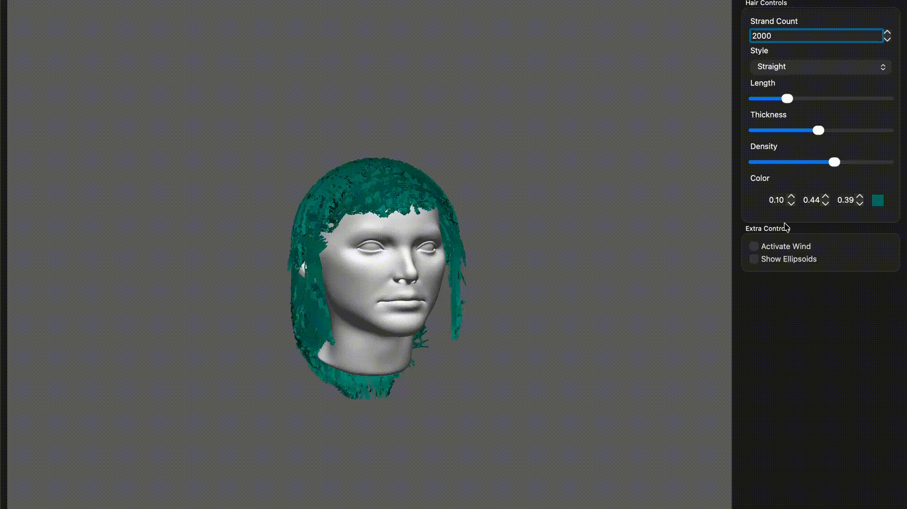

<!Doctype html>

<html width="100%" height="100%">
<header>
  
  <h1 align="center">Felipe Hidalgo</h1>

  <strong>Pipeline TD · Senior Software Engineer · Rendering Engineer</strong>

  Building pipelines, tools and rendering systems for Animation, VFX and Real-Time workflows.

  
  
  

</header>
<body>

## 👨‍💻 Profile

With several years of experience in software development, I’m a software engineer specialising in automation, tooling and workflow development, with a focus on **VFX, animation and real-time pipelines**.

### Main Areas of Interest

- 🤝 **Engineering for Others**: creating tools and solutions that make artists' and teams' workflows easier and more efficient
- 🎬 **Pipeline Development**: DCC integrations, workflow design and production pipelines
- 🌐 **OpenUSD**: scene interchange, asset workflows and scalable scene management
- 🛠️ **Tools & Automation**: developing tools that streamline workflows and connect applications
- 💡 **Rendering**: physically based rendering, ray tracing and rendering architectures
- ⚡ **Performance & Scalability**: optimisation, parallel processing and efficient systems
- 🧩 **Software Architecture**: building robust, maintainable and scalable software

## 💻 Programming & Engineering

  <!-- Programming Languages -->
  
  
  
  
  
  
  
  
  

  <!-- Web & Application Development -->
  
  
  
  
  

  <!-- Graphics & Systems -->
  
  
  
  

  <!-- Cloud & Infrastructure -->
  
  
  
  
  
  

  <!-- Development Tools -->
  
  
  
  

## 🎨 Rendering & Graphics

  
  
  
  
  
  
  

## 🖥️ DCC & Creative Tools

  
  
  
  
  

## 💿 Platforms & Operating Systems

  
  
  
  
  
  
  

## 🚀 Selected Projects

<table align="center">
  <tr>
    <td align="center" width="50%">
      
       
      
    </td>
    <td align="center" width="50%">
      
       
      
    </td>
  </tr>
  <tr>
    <td align="center" width="50%">
      
       
      
    </td>
    <td align="center" width="50%">
      
       
      
    </td>
  </tr>
</table>

## 📊 GitHub Statistics

  
  

  <i>Building tools, solving problems, and exploring where software engineering meets computer graphics.</i>

</body>

</html>
